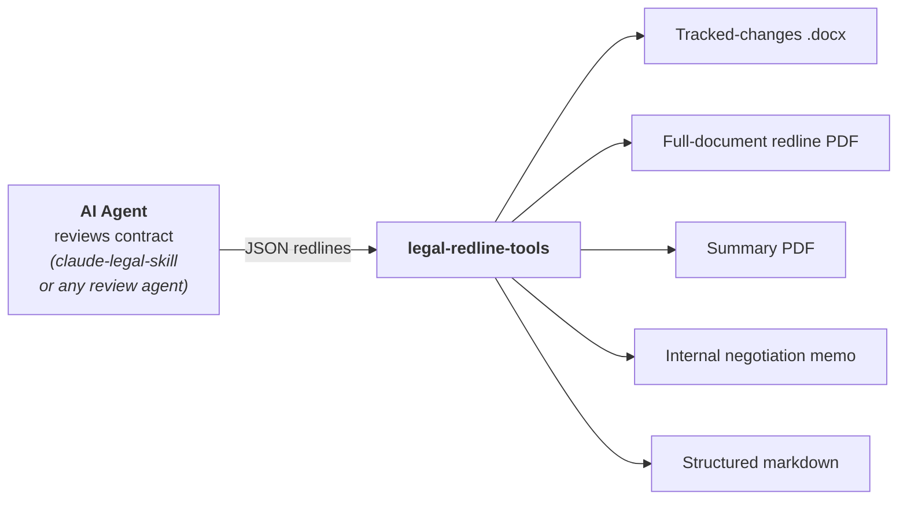
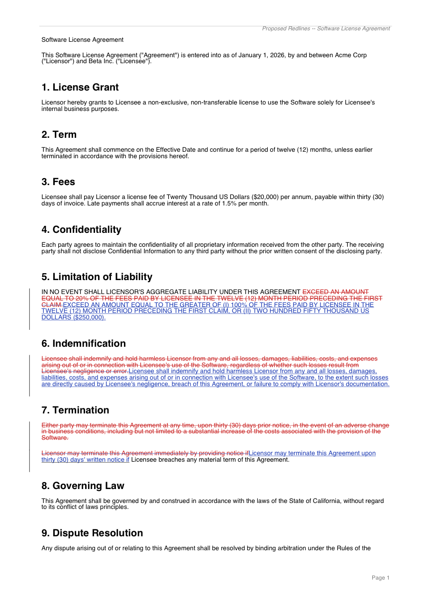
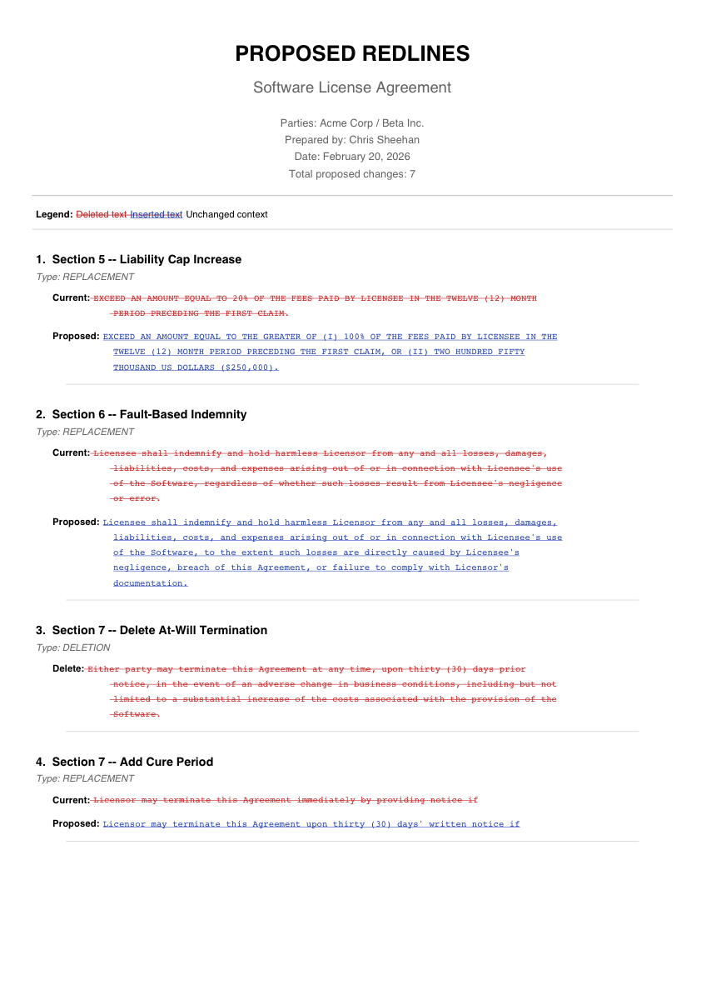
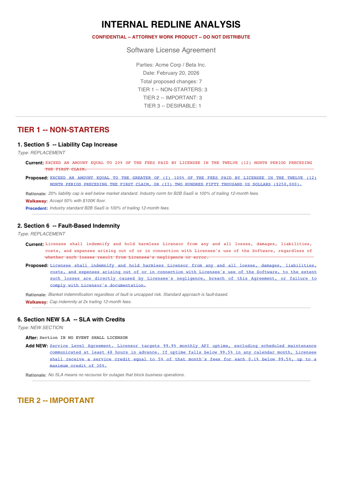

# legal-redline-tools

[](https://github.com/evolsb/legal-redline-tools/stargazers)
[](https://opensource.org/licenses/MIT)
[](https://www.python.org/downloads/)
[](CHANGELOG.md)

**Generate tracked-changes Word docs and redline PDFs from a contract review — the same deliverables lawyers actually send.**

Define your proposed changes as JSON. Get a tracked-changes `.docx` with real accept/reject markup, full-document redline PDFs, internal negotiation memos, and structured markdown. Works with any AI contract review agent or manual workflow.

## The Problem

AI contract review is everywhere now. But every tool stops at *analysis* — a list of issues in a chat window. The lawyer on the other side doesn't want your AI's opinion. They want a marked-up Word file with tracked changes they can accept or reject, and a redline PDF they can print and read.

python-docx has [refused to add tracked changes for 9 years](https://github.com/python-openxml/python-docx/issues/340). So AI tools are stuck behind a manual copy-paste wall: the agent finds the issues, then a human spends an hour transcribing them into Word's track changes by hand.

**This tool eliminates that wall.** Give it a `.docx` and a list of changes as JSON, and it produces everything — from the tracked-changes Word file your counterparty will review, to the internal negotiation memo your team will use to prepare.

## How It Works



1. **Review** — An AI agent (like [claude-legal-skill](https://github.com/evolsb/claude-legal-skill)) analyzes the contract, identifies issues, and classifies them by tier
2. **Iterate** — Discuss findings in chat, adjust positions, add walkaway thresholds
3. **Generate** — The agent outputs a JSON array of redlines, and this tool produces all deliverables
4. **Send** — External files go to the counterparty. Internal memo stays with your team.

## Output Examples

<table>
<tr>
<td align="center"><strong>Full-Document Redline PDF</strong></td>
<td align="center"><strong>Summary of Changes</strong></td>
<td align="center"><strong>Internal Negotiation Memo</strong></td>
</tr>
<tr>
<td></td>
<td></td>
<td></td>
</tr>
<tr>
<td>Entire contract with inline red strikethrough, blue underline, and change bars</td>
<td>Clean schedule of proposed changes for the counterparty</td>
<td>Tier-grouped analysis with rationale, walkaway positions, and precedent</td>
</tr>
</table>

Plus: **tracked-changes `.docx`** (real Word accept/reject) and **structured markdown** for AI pipeline chaining.

## Capabilities

| # | Feature | Description |
|---|---------|-------------|
| 1 | **Tracked-changes `.docx`** | Real Word tracked changes (strikethrough + insertion) that recipients can accept/reject |
| 2 | **Full-document redline PDF** | Entire contract with inline markups, change bars, and summary page |
| 3 | **Summary PDF** | Schedule of proposed changes (external for counterparty, internal with rationale) |
| 4 | **Internal memo PDF** | Tier-grouped analysis with rationale, walkaway positions, and precedent |
| 5 | **Markdown** | Structured output for PRs, documentation, or AI pipeline chaining |
| 6 | **Document diff** | Compare two `.docx` files and auto-generate redlines from differences |
| 7 | **Section remapping** | Remap redline section references when switching document versions |
| 8 | **Cross-agreement comparison** | Compare redline sets across related agreements for consistency |
| 9 | **Placeholder scanner** | Find blank fields, `$X`, `TBD`, and missing exhibit references |

## Install

From source:

```bash
git clone https://github.com/evolsb/legal-redline-tools.git
cd legal-redline-tools
pip install -e .
```

Or directly from GitHub:

```bash
pip install git+https://github.com/evolsb/legal-redline-tools.git
```

## Quick Start

### CLI

```bash
# Apply redlines from JSON and generate all outputs
legal-redline apply original.docx output.docx \
    --from-json redlines.json \
    --pdf full-redline.pdf \
    --summary-pdf summary.pdf \
    --memo-pdf internal-memo.pdf \
    --markdown redlines.md \
    --header "Proposed Redlines — Feb 2026"

# Inline changes (no JSON file needed)
legal-redline apply original.docx output.docx \
    --replace "old text" "new text" \
    --delete "text to remove" \
    --insert-after "anchor text" "new text"

# Compare two document versions
legal-redline diff original.docx revised.docx -o changes.json

# Scan for blank fields and placeholders
legal-redline scan contract.docx

# Remap section references to a new document
legal-redline remap old-agreement.docx new-agreement.docx \
    --redlines redlines.json -o remapped.json

# Compare redlines across agreements
legal-redline compare \
    --agreements msa=msa-redlines.json tri-party=triparty-redlines.json \
    -o comparison.md
```

### Python API

```python
from legal_redline import (
    apply_redlines, render_redline_pdf, generate_summary_pdf,
    generate_memo_pdf, generate_markdown, diff_documents,
    remap_redlines, compare_agreements, format_comparison_report,
    scan_document,
)

redlines = [
    {"type": "replace", "old": "20% of fees", "new": "100% of fees or $250K",
     "section": "7.2", "title": "Liability Cap", "tier": 1,
     "rationale": "20% is below market standard"},
    {"type": "delete", "text": "shall terminate without liability"},
    {"type": "insert_after", "anchor": "Effective Date",
     "text": ". 90-day termination right"},
    {"type": "add_section", "after_section": "Section 12",
     "text": "New audit rights clause...", "new_section_number": "12A"},
]

# Tracked-changes .docx
apply_redlines("original.docx", "output.docx", redlines)

# Full-document redline PDF
render_redline_pdf("original.docx", redlines, "redline.pdf",
                   header_text="Proposed Redlines")

# Summary PDF (external — clean, no rationale)
generate_summary_pdf(redlines, "summary.pdf",
                     doc_title="Merchant Agreement v3", mode="external")

# Internal memo PDF (tier-grouped analysis)
generate_memo_pdf(redlines, "memo.pdf", doc_title="Merchant Agreement v3")

# Markdown output
md = generate_markdown(redlines, doc_title="Agreement", mode="internal")

# Diff two documents → redlines JSON
changes = diff_documents("v1.docx", "v2.docx")

# Remap sections between document versions
updated, report = remap_redlines("old.docx", "new.docx", redlines)

# Cross-agreement comparison
result = compare_agreements({"msa": msa_redlines, "sow": sow_redlines})
print(format_comparison_report(result))

# Scan for placeholders
report = scan_document("contract.docx")
```

## JSON Format

Redlines are a JSON array. Each entry has a `type` and type-specific fields, plus optional metadata for internal analysis.

### Redline Types

| Type | Required Fields | Description |
|------|----------------|-------------|
| `replace` | `old`, `new` | Find and replace text with tracked change |
| `delete` | `text` | Delete text as tracked deletion |
| `insert_after` | `anchor`, `text` | Insert new text after anchor |
| `add_section` | `text`, `after_section` | Insert new paragraph/section |

### Optional Metadata

| Field | Used In | Description |
|-------|---------|-------------|
| `section` | All outputs | Contract section reference (e.g. "7.2") |
| `title` | All outputs | Human-readable title |
| `tier` | Internal only | Priority 1-3 (1=non-starter, 2=important, 3=desirable) |
| `rationale` | Internal only | Why the change is proposed |
| `walkaway` | Internal only | Fall-back position |
| `precedent` | Internal only | Market standard reference |

See [`examples/sample-redlines.json`](examples/sample-redlines.json) for a complete example with all 4 types.

## Output Modes

**External** (counterparty-facing) — Clean outputs with only the proposed changes. No rationale, tiers, or walkaway positions. This is what you send to the other side.

**Internal** (team-facing) — Full analysis with strategy context. Tier-grouped memos with rationale, walkaway positions, and precedent citations. Never send these to the counterparty.

## Text Matching

Redline text fields (`old`, `text`, `anchor`) must match text in the document. The matching engine handles common mismatches automatically:

- **Smart quotes** — Curly quotes normalized to straight quotes
- **Whitespace** — Tabs, double spaces, and PDF conversion artifacts collapsed
- **Dashes** — En-dashes and em-dashes treated as hyphens
- **Cross-run** — Text split across bold/italic formatting runs matched as plain text

## Companion: AI Contract Review Skill

This tool pairs with [**claude-legal-skill**](https://github.com/evolsb/claude-legal-skill) — an open-source AI agent skill for contract review that covers NDAs, SaaS agreements, M&A documents, and payment/merchant agreements. The skill handles the analysis (risk detection, market benchmarks, position-aware review); this tool handles the output.

You can also use legal-redline-tools with any AI agent or manual workflow — just produce the JSON format above.

To use the included redline-generation skill with Claude Code:

```bash
mkdir -p ~/.claude/skills/contract-redline
cp skill.md ~/.claude/skills/contract-redline/skill.md
```

## License

[MIT](LICENSE)
